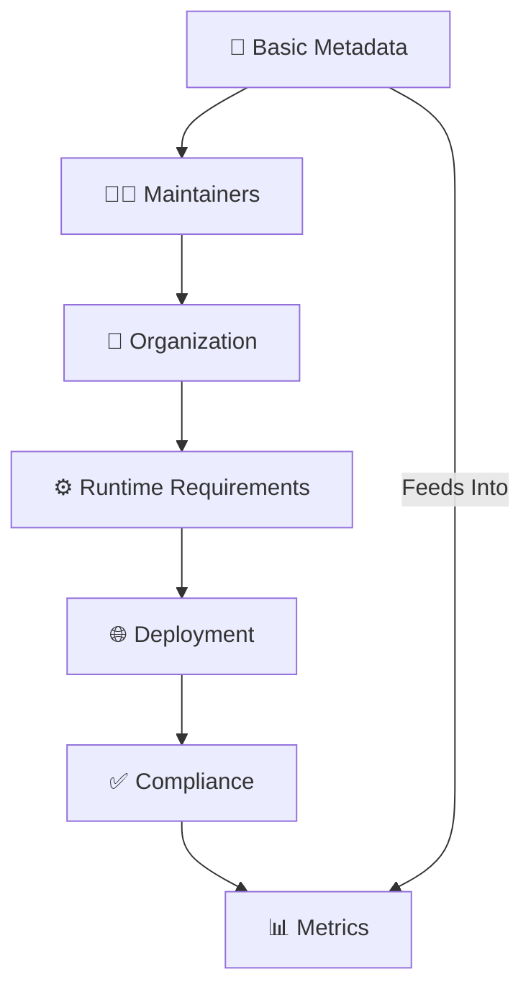

# 📝 My Sample Project (`PROJECTINFO.md`)
> 📖 This file acts as a **comprehensive identity card** for the project.  
> It blends **machine-readable YAML metadata** (above) with **human-friendly documentation** (below).
---
## 📌 Basic Metadata
| Field | Value |
|-------|-------|
| **Project Title** | PROJECT INFO SYS |
| **System Slug** | `project-info-sys` |
| **Project ID** | qauproject-2025 |
| **Version** | v1.2.0 |
| **First Release** | 2023-09-10 |
| **Last Updated** | 2025-09-15 |
| **Status** | 🟢 Active |
| **Languages (UI)** | en, ar |
| **Tech Stack** | Python · JavaScript |
| **Database** | PostgreSQL |
| **Frameworks** | Django · React |
| **Architecture** | Client-Server (REST + WebSockets) |
| **License** | MIT |
| **Docs** | [Documentation](https://docs.qau.edu.ye/) |
| **Demo** | [Homepage/Demo](https://demo.qau.edu.ye/) |
| **Keywords** | AI · Machine Learning · NLP |
---
## 👨‍💻 Maintainers / Developers
- **Saddam Al-Slfi** – Lead Developer @ Open Source Lab, Queen Arwa University   📧 saddamalsalfi@qau.edu.ye · [GitHub](https://github.com/saddamalsalfi) · ORCID: 0000-0002-4006-0193 · 🕒 UTC+3
- **Jane Smith** – Backend Engineer @ TechCorp Ltd.   📧 jane@techcorp.com · [GitHub](https://github.com/janesmith) · [LinkedIn](https://linkedin.com/in/janesmith) · 🕒 UTC+0
---
## 🏢 Organization
- **Entity:** Open Source Lab, Queen Arwa University
- **Support:** support@qau.edu.ye
- **Issue Tracker:** GitHub Issues
- **Channels:** [Discussions](https://github.com/org/repo/discussions) · [Slack](https://workspace.slack.com/project) · Mailing List
---
## ⚙️ Runtime Requirements
- **Environments:** Linux (Ubuntu 22.04+), Windows 11, macOS Ventura
- **Dependencies:** Python >= 3.9, Node.js >= 18, PostgreSQL >= 13
- **Optional Libraries:** NumPy >= 1.25, TensorFlow >= 2.15, Express.js >= 5.0
- **Build Tools:** pip, npm, Docker
---
## 🌐 Deployment
- **Methods:** Docker Compose, Kubernetes (Helm Chart)
- **Cloud Providers:** AWS, Azure, GCP
- **CI/CD Pipelines:** GitHub Actions, Jenkins
---
## ✅ Compliance
- **SPDX License:** MIT
- **Funding:** National Research Fund
- **Data Policy:** [DATA_POLICY.md](./DATA_POLICY.md)
- **Accessibility:** WCAG 2.1 AA
- **Security Audit:** 2025-05-12 (SecureCode Inc.)
- **Code of Conduct:** [CODE_OF_CONDUCT.md](./CODE_OF_CONDUCT.md)
---
## 📊 Metrics
- **Unit Test Coverage:** 87%
- **Build Status:** ✅ Passing
- **Known Issues:** See label `'known-issue'`
- **Roadmap:** [ROADMAP.md](./ROADMAP.md)
---
## 📈 Visual Overview
